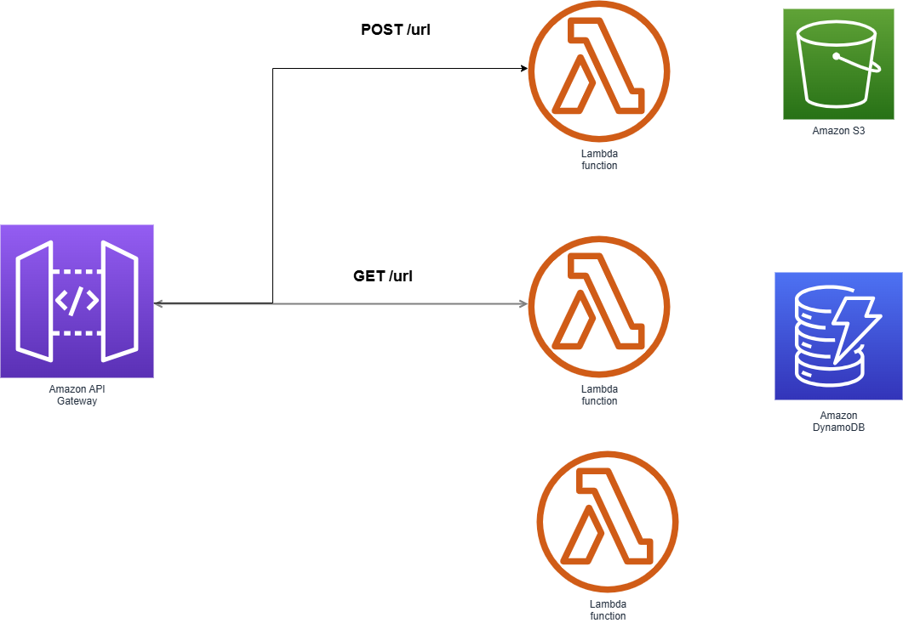
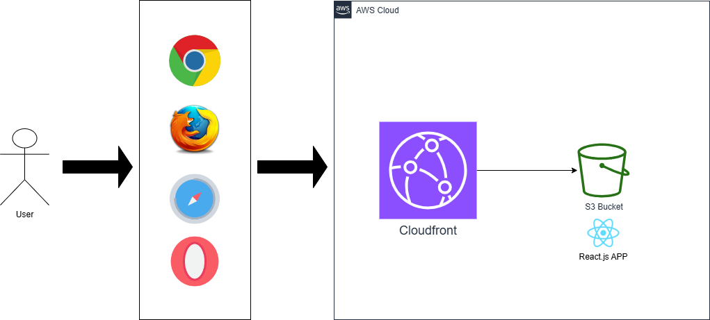

# URL Shortener

The final url is --> https://d2a6wanazzhby9.cloudfront.net/


# High available solution

The solution should be deployed into several AWS Regions, where Cloudfront will be addressing the traffic base of latency and It will detect if one region is not responding.


# Architectural decisions

| Component | Product/Software | SLA | Alternatives | Decicision|
| ------------- | ---- | ------------- | ------------- | ------------- |
| Cloud provider | N/A | AWS  | CGP, IBM Cloud, Azure, Heroku| Plenty of services. Several pricing plans. Lot of documentation. Large technical community. Easy to scale due to integration with several services. |
| API Gateway | AWS API Gateway | 99.95% | IBM API Connect, Cloudflare, | Easy integration to AWS's services  |
| CDN | Cloudfront  | 99.99% |  | Easy integration to AWS's services  |
| Database | Dynamodb  | 99.99% | SQLServer, MySQL, MongoDB, Cloudant | Managed NoSQL database - serverless. Flexible. High performance. Use of Global Secondary Index in order to avoid consume of capacity.   |
| Runtime | Lambda  |  99.95% | Kubernetes (ECS,EKS), Virtual Machine(EC2) | Serverless+Auto-scale instances. Easy integration with load balancers and spread across several Regions using Coudfront.  |
| Programming Language | Javascript/Nodejs  | N/A | Python, Java | Selected due to previous experience |
| Version Control | Github  | 99.9% | Gitlab, Codecommit | Well known cloud-based tool. Free. |


# Backend solution

The backend is developed using Node.js 20.x and deployed on Lambda, in order to quickly scale-out instances during high demand.



## Node.js

Javascript is a flexible programming language that allows to develop solution really fast. Having a big community there are plenty of solutions
already created that can be reused and customized in order to support requirement's needs.

## Lambda

Lambda is a serverles, Platform as a Service ( PaaS ), that means that it doesn't require compute provisioning.

Advantages for this requirement:
- No need to manage infra. Focus only on development.
- Scale up/down based on demand.
- Easy to integrate with API gateway.
- Widely used, full of documentation/training available on the web

## DynamoDB

Dynamodb provides a serverless solution that speed up the development and scale of the solution. As a JSON documento databases, It provides easy integration to Javascript (node.js) applications.

Additionally, AWS have several features that can improve the capacity, such as:
- Global tables in order to have the same data in several Regions
- Amazon DynamoDB Accelerator (DAX)

# Frontend

React.js a well known library, which was created by Meta, for creating web and mobiles user interfaces.
Ant-Design is used in order to have pre-configured ui components and deal with differents dispositives.



# Cloudfront

Cloudfront is a globally-distributed network offered by Amazon Web Services, which securely transfers content such as software, SDKs, videos, etc., to the clients, with high transfer speed.

The bundle of the frontend application, which is developed using React.js library, It is stored in AWS S3 in order to be distributed to the users through Cloudfront. 
This solution allows to cache and serve static files faster.

## Executing locally

### Software requirements

- Visual Studio Code
- Git --> https://git-scm.com/book/en/v2/Getting-Started-The-Command-Line
- Node.js >= v18.x --> https://nodejs.org/en/download/package-manager
- Docker compose / podman compose --> https://podman-desktop.io/
- AWS Cli --> https://docs.aws.amazon.com/cli/latest/userguide/getting-started-install.html
- AWS SAM Cli --> https://docs.aws.amazon.com/serverless-application-model/latest/developerguide/install-sam-cli.html
- 

### Installation 

- aws configure
- https://github.com/sebaeze/url-shortener.git
- cd ./dynamodb
- docker-compose up
- Create local table:
```bash
aws dynamodb create-table --cli-input-json file://createTable.json  --endpoint-url http://localhost:8000
aws dynamodb list-tables  --endpoint-url http://localhost:8000

aws dynamodb put-item --table-name URL --item file://new_item.json  --endpoint-url http://localhost:8000
aws dynamodb scan --table-name URL  --endpoint-url http://localhost:8000
```
- cd backend

### Run and Test backend locally

- Docker should be running
```bash
sudo service docker start
sudo service docker status
```
- Run SAM utility:
```bash
cd backend
sam build --cached
sam local invoke getByIdFunction --event ./events/event-get-by-id.json
```

### Run and Test frontend locally

- 
```bash
cd frontend
npm install
npm start
```
- Open in browser http://127.0.0.1:3000

# Deploy to AWS

- cd backend
- sam build  --cached
- sam deploy --guided 

# Pending:

- Automated deployments, using pipelines from tools, such as: Github Actions, CodeDeploy, etc.
- Automated testing.

# References

- https://aws.amazon.com/blogs/compute/build-a-serverless-private-url-shortener/
- https://medium.com/@sandeep4.verma/system-design-scalable-url-shortener-service-like-tinyurl-106f30f23a82
- https://ant.design/docs/react/introduce
- https://docs.aws.amazon.com/Route53/latest/DeveloperGuide/getting-started-cloudfront-overview.html
- https://docs.aws.amazon.com/amazondynamodb/latest/developerguide/DAX.create-cluster.console.html