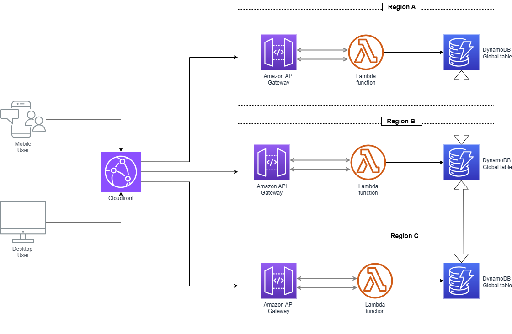
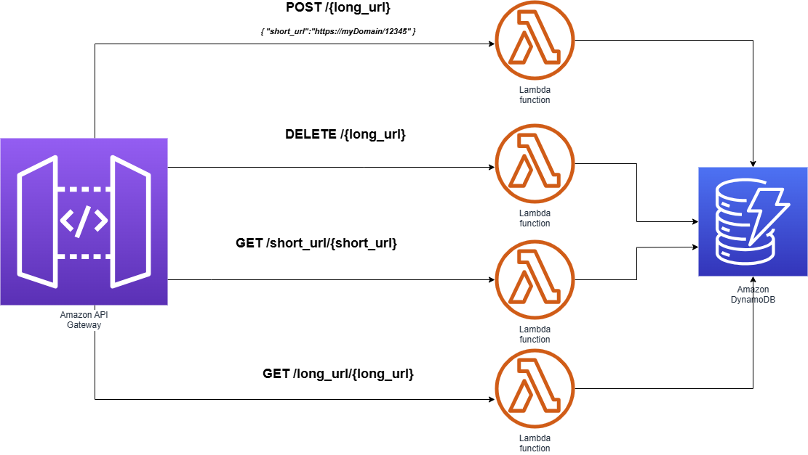

# api-shortener
URL shortener like goo.gl, https://www.shorturl.at/ or https://bitly.com/ for publishing promotions over Twitter

# Architectural decisions

| Component | Product/Software | SLA | Alternatives | Decicision|
| ------------- | ---- | ------------- | ------------- | ------------- |
| Cloud provider | N/A | AWS  | CGP, IBM Cloud, Azure, Heroku| Plenty of services. Several pricing plans. Lot of documentation. Large technical community. Easy to scale due to integration with several services. |
| API Gateway | AWS API Gateway | 99.95% | IBM API Connect, Cloudflare, | Easy integration to AWS's services  |
| CDN | Cloudfront  | 99.99% |  | Easy integration to AWS's services  |
| Database | Dynamodb  | 99.99% | SQLServer, MySQL, MongoDB, Cloudant | Managed NoSQL database - serverless. Flexible. High performance.   |
| Runtime | Lambda  |  99.95% | Kubernetes (ECS,EKS), Virtual Machine(EC2) | Automatic scale. Easy to integrate with load balancers and spread across several Regions using Coudfront.  |
| Programming Language | Javascript/Nodejs  | N/A | Python, Java | Selected due to previous experience |
| Version Control | Github  | 99.9% | Gitlab, Codecommit | Well known cloud-based tool. Free. |


# High available solution

The solution should be deployed into several AWS Regions, where Cloudfront will be addressing the traffic base of latency and It will detect if one region is not responding.



# Backend solution

The backend is developed using Node.js 20.x and deployed on Lambda, in order to quickly scale-out instances during high demand.



### Well-Architected Framework

- Operational Excellence
- Security
- Reliability
- Performance Efficiency
- Cost Optimization
- Sustainability

https://aws.amazon.com/architecture/well-architected/
https://www.wellarchitectedlabs.com/


# Reference Architectures

- https://aws.amazon.com/blogs/compute/build-a-serverless-private-url-shortener/
- 
## Executing locally

### Software requirements

- Visual Studio Code
- Git --> https://git-scm.com/book/en/v2/Getting-Started-The-Command-Line
- Node.js >= v18.x --> https://nodejs.org/en/download/package-manager
- Docker compose / podman compose --> https://podman-desktop.io/
- AWS Cli --> https://docs.aws.amazon.com/cli/latest/userguide/getting-started-install.html
- AWS sam clie --> https://docs.aws.amazon.com/serverless-application-model/latest/developerguide/install-sam-cli.html
- 

### Installation 

- aws configure
- https://github.com/sebaeze/url-shortener.git
- cd ./dynamodb
- docker-compose up
- Create local table:
```bash
aws dynamodb create-table --cli-input-json file://createTable.json  --endpoint-url http://localhost:8000
aws dynamodb list-tables  --endpoint-url http://localhost:8000

aws dynamodb put-item --table-name URL --item file://new_item.json  --endpoint-url http://localhost:8000
aws dynamodb scan --table-name URL  --endpoint-url http://localhost:8000
```
- cd serverless-lambda
- npm install
- npm start
-

### Deploy to AWS
- cd serverless-lambda
- sam deploy --guided 

